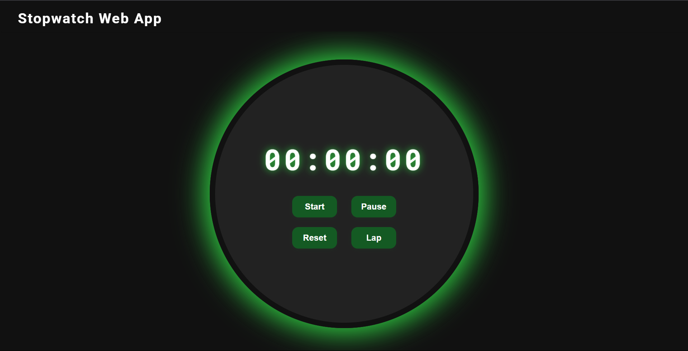
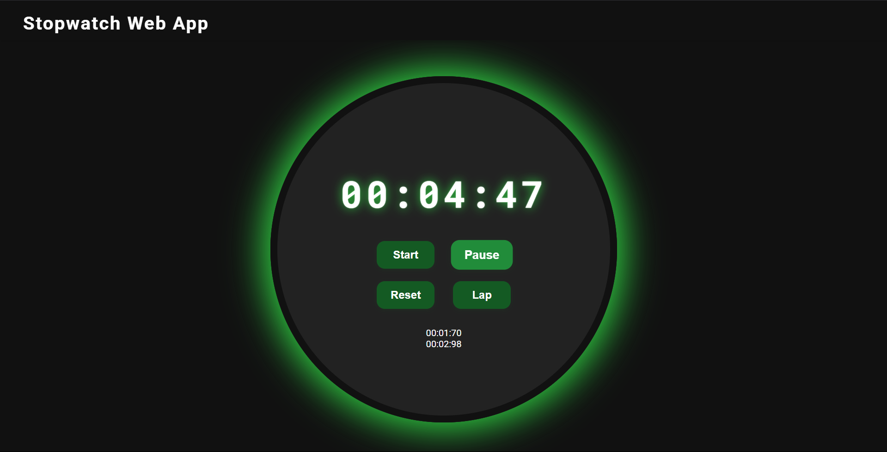

# PRODIGY_WD_02
# Stopwatch Application

A simple and interactive stopwatch web application built using HTML, CSS, and JavaScript. Features include start, pause, reset, and lap time tracking for accurate time measurement.

## Project Structure

```

── src
│   ├── index.html       # Main HTML document for the stopwatch application
│   ├── styles
│   │   └── style.css    # Styles for the stopwatch application
│   └── scripts
│       └── app.js       # JavaScript code for stopwatch functionality
└── README.md            # Documentation for the project
```

## Features

- Start, pause, and reset functionality
- Lap time tracking
- User-friendly interface

## Usage

1. Open `src/index.html` in a web browser to view the stopwatch application.
2. Use the buttons to control the stopwatch.
3. View lap times as they are recorded.

## Screenshots

> Below are some screenshots of the Stopwatch Application:




